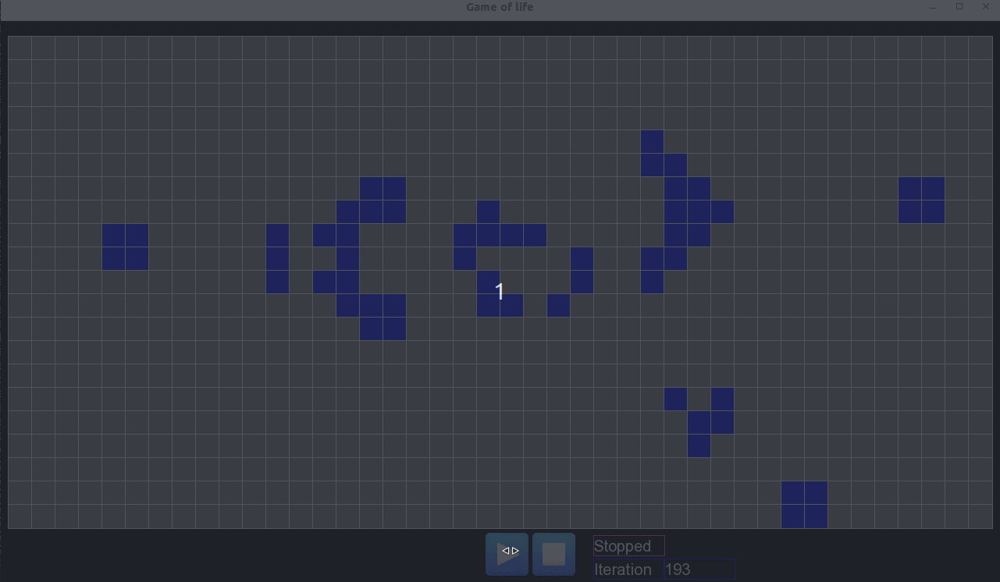

# Game of Life in CPP

## Descrition
This is a CPP implementation of the [Conway's Game of Life](https://en.wikipedia.org/wiki/Conway%27s_Game_of_Life).
Is designed to be used in learning activities (workshops, code retreats).

The graphical interface isdeveloped in [SFML library](https://www.sfml-dev.org/index.php).
The unit test are written using [googletest](https://github.com/google/googletest)

## Setup project

### Setup ubuntu
WIP
### Setup on windows
WIP

## Limitations
Currently building gtest fails on clang
